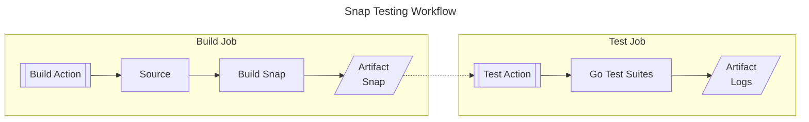

# EdgeX Snap Tests
Test scripts, Github actions, and workflows for the [EdgeX Foundry](https://docs.edgexfoundry.org/) snaps.

The following diagram shows the Snap Testing workflow for building and testing snaps from upstream source code:


The Github Workflow configurations (triggers, jobs, etc) are maintained in respective upstream source codes.  
The Github Actions and testing suites are maintained in this repository.

For example, [this](https://github.com/edgexfoundry/edgex-go/blob/main/.github/workflows/snap.yaml) is the workflow of the tests that run on the edgex-go project. The Github Actions used in the workflow are versioned using a major semantic versioning tag. This tag is [automatically moved](https://github.com/canonical/edgex-snap-testing/blob/main/.github/workflows/versioning.yml) to the latest minor and patch releases of the tests (this repository).

This project has additional [workflows](https://github.com/canonical/edgex-snap-testing/tree/main/.github/workflows) such as for running the tests weekly and on local PRs.

## Test locally
This section includes example command to run tests.

Useful `go test` flags are:
- `-v` is to enable verbose output
- `-failfast` makes the test stop after first failure
- `-timeout 60m` extends the timeout to longer than the default 10m
- `-count 1` is to avoid Go test caching for example when testing a rebuilt snap

#### Run one testing suite
```bash
go test -v -failfast -count 1 ./test/suites/device-mqtt
```

#### Run all suites
```bash
go test -p 1 -timeout 60m -failfast -count 1 ./test/suites/...
```

#### Run one suite with env variables
The environment variables are defined in [test/utils/env.go](./test/utils/env.go)

Full config test:
```bash
FULL_CONFIG_TEST=true go test -v -failfast -count 1 ./test/suites/device-mqtt
```

Testing with a local snap:
```bash
LOCAL_SNAP="edgex-device-mqtt_2.0.1-dev.15_amd64.snap" go test -v -failfast -count 1 ./test/suites/device-mqtt
```

Test with skipping the removal of snaps during teardown:
```bash
SKIP_TEARDOWN_REMOVAL=true go test -v -failfast -count 1 ./test/suites/
```

Test by revision:
```
PLATFORM_CHANNEL=4259 go test -v -failfast -count 1 ./test/suites/edgex-no-sec
```
This requires developer access; see `snap install -h` for details.

#### Run only one test from a suite
```
go test -v ./test/suites/edgexfoundry --run=TestAddProxyUser
```
```
go test -v ./test/suites/edgex-config-provider -run=TestConfigProvider/device-virtual
```

#### Test the testing utils
```bash
go test ./test/utils -count=10
```

#### Run EdgeX Ubuntu Core tests
Refer to [./test/suites/ubuntu-core-edgex-image](test/suites/ubuntu-core-edgex-image)

## Test using Github Actions
This project includes two Github Actions that can be used in workflows to test snaps:
* [build](./build): Checkout code, build the snap, and upload snap as build artifact
* [test](./test): Download the snap from build artifacts (optional) and run smoke tests

A workflow that uses both the actions from `v2` branch may look as follows:

`.github/workflows/snap.yml`
```yaml
name: Snap Testing

on:
  pull_request:
    branches: [ main ]
  # allow manual trigger
  workflow_dispatch:

jobs:
  build:
    runs-on: ubuntu-latest
    steps:
      - name: Build and upload snap
        id: build
        uses: canonical/edgex-snap-testing/build@v2
    outputs:
      snap: ${{steps.build.outputs.snap}}

  test:
    needs: build
    runs-on: ubuntu-latest
    steps:
      - name: Download and test snap
        uses: canonical/edgex-snap-testing/test@v2
        with:
          name: device-mqtt
          snap: ${{needs.build.outputs.snap}}
```
