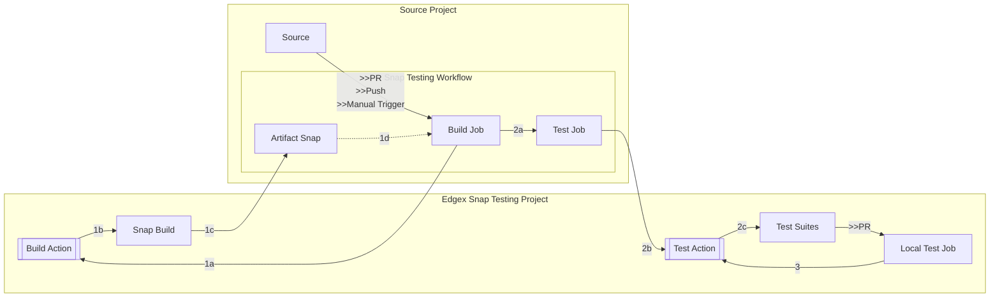

# EdgeX Snap Tests
Test scripts, Github actions, and workflows for the [EdgeX Foundry](https://docs.edgexfoundry.org/) snaps.



## Test locally
Test one, e.g.:
```bash
go test -p 1 ./test/suites/device-mqtt
```
The `-p 1` is set to force sequential run and avoid snapd and logical error.

Set `-v` for verbose output.

To test all:
```bash
go test -p 1 ./test/suites/...
```

Test the testing utils:
```bash
go test ./test/utils -count=10
```

## Override behavior
Use environment variables, as defined in [test/utils/env.go](./test/utils/env.go)

## Test using Github Actions
This project includes two Github Actions that can be used in workflows to test snaps:
* [build](./build): Checkout code, build the snap, and upload snap as build artifact
* [test](./test): Download the snap from build artifacts (optional) and run smoke tests

A workflow that uses both the actions from `v2` branch may look as follows:

`.github/workflows/snap.yml`
```yaml
name: Snap Testing

on:
  pull_request:
    branches: [ main ]
  # allow manual trigger
  workflow_dispatch:

jobs:
  build:
    runs-on: ubuntu-latest
    steps:
      - name: Build and upload snap
        id: build
        uses: canonical/edgex-snap-testing/build@v2
    outputs:
      snap: ${{steps.build.outputs.snap}}

  test:
    needs: build
    runs-on: ubuntu-latest
    steps:
      - name: Download and test snap
        uses: canonical/edgex-snap-testing/test@v2
        with:
          name: device-mqtt
          snap: ${{needs.build.outputs.snap}}
```
